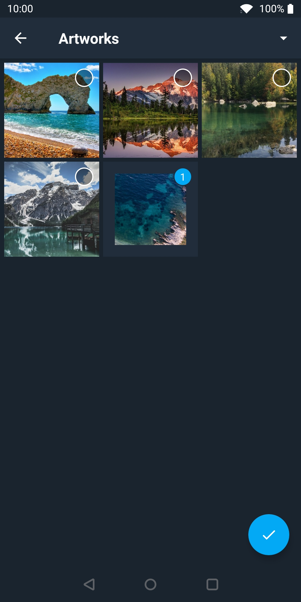
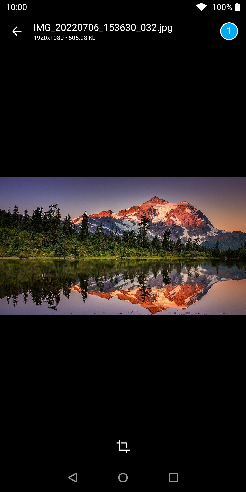
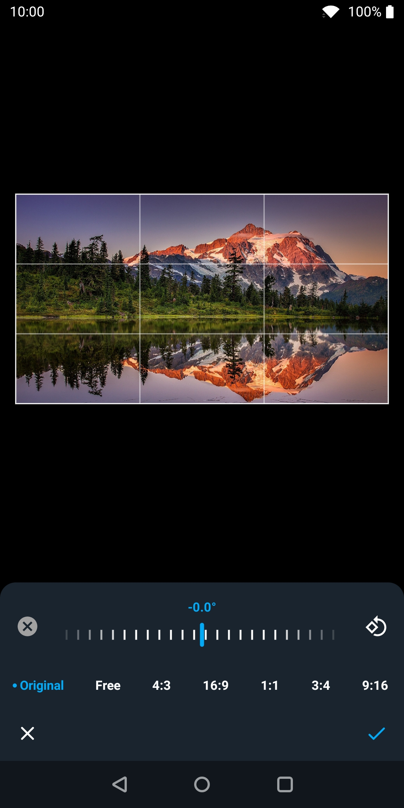

# piCropper 
Android library, which helps to pick images from a device and crops them

# Preview 
  

# Usage

1. Include the library to your project

	```
	allprojects {
	   repositories {
	      jcenter()
	      maven { url "https://jitpack.io" }
	   }
	}
	```
  
    ``` implementation 'com.github.VladYatsenko:pi-cropper:1.0' ```
    
# Customization
### Setup params
| Param | Description | Default value |
| --- | --- | --- |
| aspectRatio | List of Aspect rations for croping image. If it has less than 2 items - aspect ratio selector won't show. | AspectRatio.defaultList |
| allImagesFolder | Name of folder with all images | All images |
| collectCount | Max images count to return | 10 |
| shouldForceOpenEditor | Open editor from images grid. Only if collectCount == 1 | false |
| circleCrop | Editor's circle crop mode | false |
| quality | Quality of edited image | 80 |

### Theming params

| Param | Description |
| --- | --- |
| accentColor | Accent color ("Provide result" floating action button, crop instruments) |
| accentDualColor | Color for icon of floating action button |
| statusBarColor | Color of android status bar |
| navigationBarColor | Color of android navigation bar |
| toolbarColor | Color of picker toolbar |
| toolbarContentColor | Color toolbar's content (icons, toolbar title) |
| gridBackgroundColor | Picker background color |
| imageBackgroundColor | Background color of selected image |
| toolsColor | Crop tools color (icons, horizontal wheel) |
| toolsResetRotationColor | Crop tools - reset rotation color |
| toolsBackgroundColor | Crop tools background color |
| checkBoxTextColor | Checkbox text color |
| checkBoxBackground | Checkbox background color |
| checkBoxCheckedBorder | Checkbox border color (checked, on grid) |
| checkBoxUncheckedBorder | Checkbox border color (unchecked) |
| checkBoxCheckedBorderOverlay | Checkbox border color (checked, in fullscreen viewer) |


